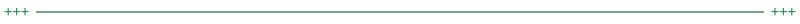

<div align="center">


[f0ss1l.vercel.app](https://f0ss1l.vercel.app) · v1 shipped

</div>

<div align="center"></div>

Every codebase is a Ship of Theseus.

Replace a function. Then the module. Then the architecture. At what point does it become something else? Nobody has a principled answer. But code leaves traces.

Comments are the most honest writing a programmer produces. Nobody writes them to be read. `"fix," "wip," "ugh," "finally."` Involuntary poetry. Sometimes a comment meant to be temporary survives everything around it — pointing at a room that no longer exists.

**F0SS1L finds them.**

<div align="center"></div>

## The Fossils

Each fossil is a real comment recovered from a real codebase. It comes with a loneliness score — the percentage of surrounding code that has been replaced since the comment was written. And a literary piece: what the comment witnessed, in its own voice.

Every fossil ends the same way.

| # | Comment | Source | Loneliness |
|---|---------|--------|------------|
| 01 | `// TODO: remove this — temporary workaround for wrapping issue` | composite — every codebase, everywhere | ∞% |
| 02 | `// No session — sign in anonymously, no login screen needed` | bubuchachar/memori-v2 | 91% |
| 03 | `/* Don't even check the return value as it's too late. */` | antirez/kilo | 89% |
| 04 | `/* Raw mode: 1960 magic shit. */` | antirez/kilo | 89% |
| 05 | `return ret_follows(pc + *pc + 1); // FIXME, might be ironic` | jqlang/jq | 94% |
| 06 | `// This mutation is ugly, even if we undo it` | jqlang/jq | 87% |
| 07 | `/* POSIX doesn't provide errno values for strftime() failures; weird */` | jqlang/jq | 92% |

<div align="center"></div>

## How It Works

v1 is fully static. Seven hand-curated fossils, each with a literary piece written from the comment's perspective. No backend, no database. The loneliness score is calculated from `git blame` — how much of the surrounding code has been replaced since the comment was written.

The interest capture at the bottom of each fossil measures demand for v2.

<div align="center"></div>

## v2 — The Tool

v2 will accept any public git repo URL and surface its oldest surviving comments automatically. The literary pieces will be generated. The archaeology will be real.

Threshold for building v2: watching signups.

<div align="center"></div>

## Stack

Pure HTML, CSS, and JavaScript. No framework, no build step, no dependencies. Deployed on Vercel.

```
src/
  index.html     — everything
assets/
  f0ss1l.svg     — logo (kerning-corrected by hand)
```

<div align="center"></div>

## Provenance

The concept came out of a free-play session on the Ship of Theseus applied to code. The literary piece about `// TODO: remove this` came first. The project emerged from it.

F0SS1L uses 0 and 1 in place of O and I — not arbitrarily. 0 and 1 are binary, the oldest layer of any codebase.

<div align="center"></div>

<div align="center">
<sub>Someone is going to ask.</sub>
</div>
